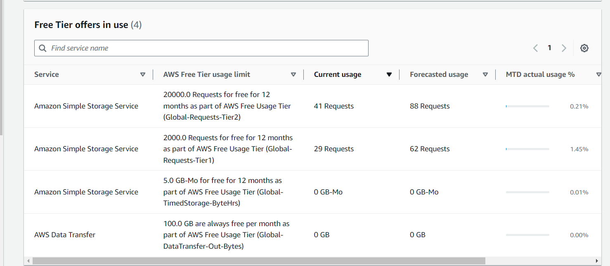

# Tools Used

- Clerk: For Authentication.
- Neon DB: Serverless Postgres for Database.
- DrizzleORM: Query builder.
- AWS S3: For file upload functionality.
- @tanstack/react-query: For asyncronous State management.
- pinecone: Vector database.
- langchain: For loading PDF and Read the text of the PDF.
- RAG: RAG is used to train AI model based on specific domain. (RAG vs LLM)

References:
RAG:

- https://techcommunity.microsoft.com/t5/educator-developer-blog/use-webgpu-onnx-runtime-web-transformer-js-to-build-rag/ba-p/4190968
- https://huggingface.co/docs/transformers/en/model_doc/rag
- https://www.youtube.com/watch?v=ztBJqzBU5kc
- https://www.youtube.com/watch?v=rb9jXHto_RU
- Question anstering using transformers.js: https://huggingface.co/docs/transformers.js/api/pipelines#pipelinesquestionansweringpipeline

TODO:

- Instead of using `pinecone` as vector database use `postgres`
- Need to Refactor code.
- Currently we are generating embeddings in `client-side`. Need to change it to `server-side`. (check 4th point in references)

`npx drizzle-kit push` for migrating the models to DB.
`npx drizzle-kit studio` to view the data.

# AWS S3 creation

Bucket Policy

CORS

### Track AWS Free Tier Usage
- https://us-east-1.console.aws.amazon.com/billing/home?region=us-east-1#/freetier

## Pinecone Terms

- Index => Database
- Namespace => Segmenting PDF `vector` space.
